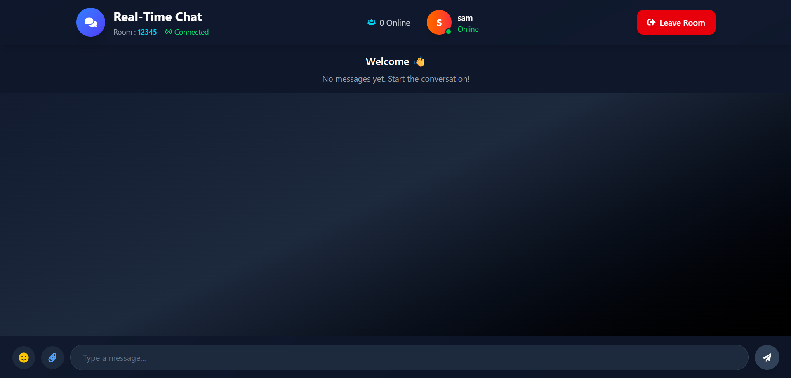

# 🚀 Real-Time Chat Platform

A full-stack real-time chat application built using **React**, **Spring Boot**, **WebSockets (STOMP + SockJS)** and **MySQL**.

## 🌐 Live Demo

Frontend:
https://real-time-chat-app-bice-mu.vercel.app

Backend:
https://real-time-chat-app-t1s1.onrender.com

---

## ✨ Features

- Real-time messaging
- Room-based chat
- Join/Create room
- Online users
- Typing indicator
- Chat history
- Join/Leave notifications
- Emoji picker
- Responsive UI
- Persistent messages using MySQL

---

## 🛠 Tech Stack

### Frontend

- React
- Vite
- Axios
- STOMP.js
- SockJS
- CSS

### Backend

- Spring Boot
- Spring WebSocket
- Spring Data JPA
- Hibernate
- MySQL

### Deployment

- Vercel
- Render

---

## 📷 Screenshots

### Home


### Chat



---

## ⚙ Installation

### Clone Repository

```bash
git clone https://github.com/SAMIT21-red/real-time-chat-app.git
```

### Backend

```bash
cd backend/chat-app/chat-app

mvn spring-boot:run
```

### Frontend

```bash
cd frontend

npm install
npm run dev
```

---

## API Endpoints

| Method | Endpoint | Description |
|---------|----------|-------------|
| POST | /api/v1/rooms | Create Room |
| GET | /api/v1/rooms/{roomId} | Get Room |
| GET | /api/v1/rooms/{roomId}/messages | Chat History |

---

## Future Improvements

- JWT Authentication
- File Sharing
- Voice Messages
- Read Receipts
- Push Notifications
- Private Chats
- Message Search

---

## Author

Samit Dubey

GitHub:
https://github.com/SAMIT21-red
